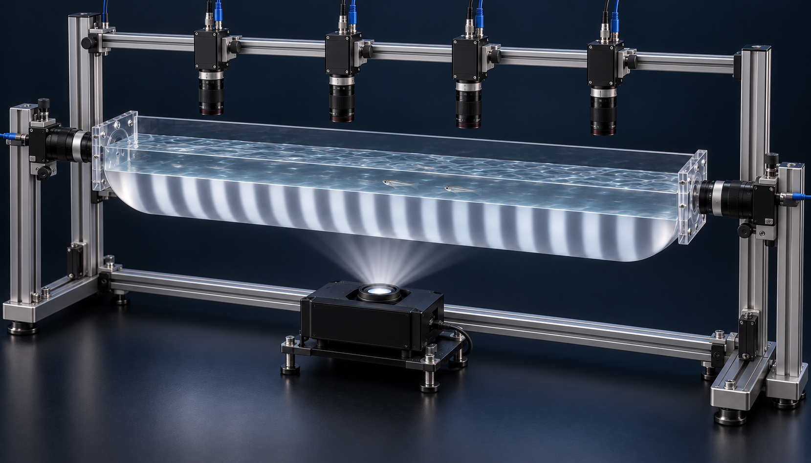
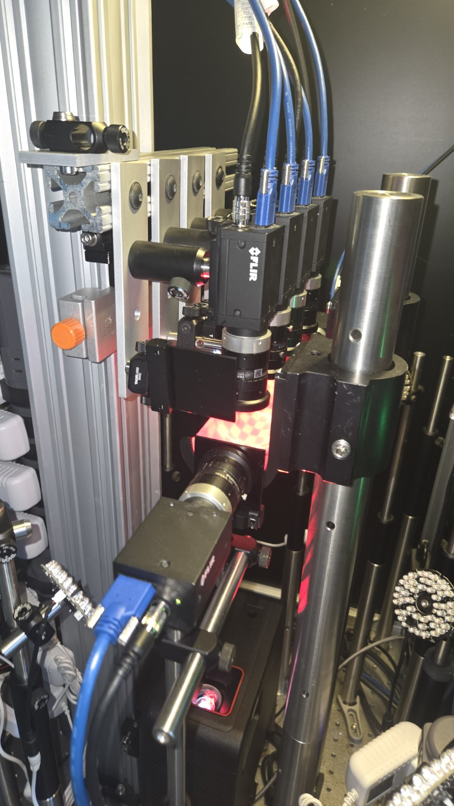
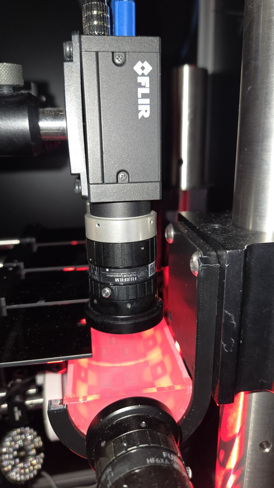
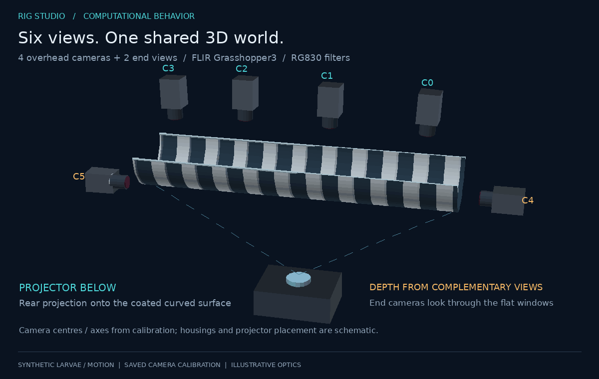
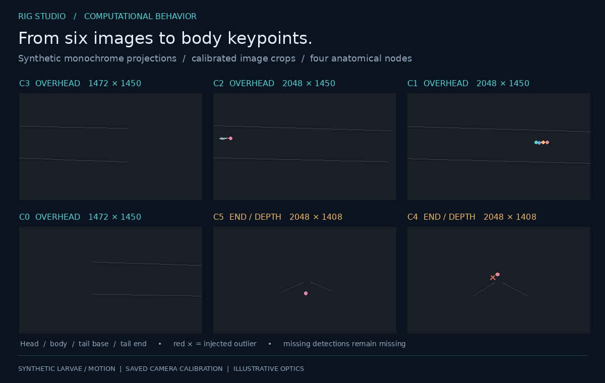
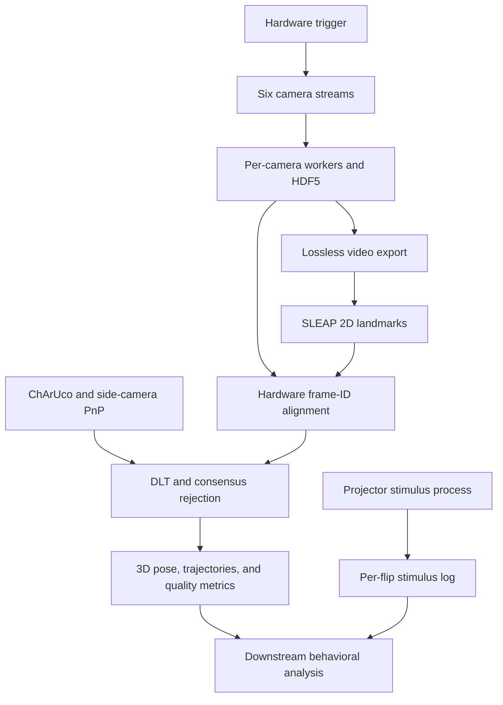

# Rig Studio

### Six-camera machine vision and 3D pose reconstruction for larval fish racing

**Harvard MCB · Summer research, 2026**

Python · C++ · OpenCV · SLEAP integration · Hardware synchronization · Computational behavior

What makes a fish win a race: **speed, persistence, or where it chooses to swim?**

This project turns the optomotor response into a quantitative racing experiment. Zebrafish and medaka larvae, including different age groups, experience a shared moving visual environment. Reconstructing their motion in 3D makes it possible to ask how swimming speed, endurance, depth choice, and conflicting visual cues shape their strategies.

I built the acquisition, calibration, stimulus-control, and reconstruction software that makes those comparisons possible: **six synchronized camera streams → learned 2D keypoints → trajectories and body pose in millimetres**, with timing and reconstruction quality carried through the pipeline.



*Concept render informed by the real rig photos below. Camera housings, supports, and optical appearance are illustrative; this is not a photograph or a dimensioned CAD model.*

[See the real apparatus](#the-real-apparatus) · [Watch the pipeline](#from-images-to-3d-pose) · [Inspect the evidence](docs/10-evidence-and-scope.md) · [Run the simulator](#try-it-without-hardware)

## What I built

| Area | Technical contribution | Why it matters |
|---|---|---|
| **Machine vision** | Six FLIR Grasshopper3 cameras on one hardware trigger; one acquisition process per camera; native C++ frame transfer into NumPy storage; streamed HDF5 recording | Preserves simultaneous views of fast motion while keeping camera acquisition separate from the GUI |
| **Camera calibration & 3D geometry** | Static ChArUco target, per-camera PnP, shared-corner metric checks, and manual side-camera correspondences | Places all six cameras in one physical coordinate frame and makes calibration quality inspectable |
| **3D pose estimation** | Confidence-filtered SLEAP keypoints, hardware-frame-ID alignment, DLT triangulation, and pairwise-consensus outlier rejection | Converts image coordinates into 3D body landmarks while retaining evidence of unreliable estimates |
| **AI/ML integration** | Lossless videos for pose labeling; ingestion of SLEAP analysis exports and confidence scores; synthetic noisy-detection evaluation | Connects learned 2D perception to geometric reconstruction without discarding timing or uncertainty |
| **Visual stimulus engineering** | A separate projector process, measured-flip phase integration, physical stimulus scale, editable shape layers, and per-flip logs | Makes the visual environment controllable and relates swimming behavior to stimulus history |
| **Experimental software** | PySide6 operator interface, configurable camera profiles, guarded setting changes, simulator backend, and hardware-free tests | Supports repeatable trials and development away from the apparatus |

The ML component is **SLEAP-based 2D pose estimation integrated with a geometric 3D pipeline**. This repository contains the integration and reconstruction code; it does not include trained weights, a training dataset, or a held-out pose-network benchmark. The project brief also named Anipose; the implemented reconstruction here uses the repository's own DLT and consensus code.

## The experiment: beyond a finish time


*Illustrative larvae and trajectories, not experimental outcomes. The grating uses the existing stimulus luminance function; its mapping onto the curved surface is schematic. A and B do not encode measured species differences.*

The scientific goal is to compare zebrafish and medaka across ages in a deep arena, including their responses to competing visual cues.

| Research question | What 3D tracking makes measurable |
|---|---|
| Does a fast start predict a win? | Along-arena progress, instantaneous speed, and changes over a trial |
| Do animals maintain the response or tire? | Response duration and changes in sustained swimming; exhaustion requires an experimental definition |
| Do animals prefer particular depths? | Depth occupancy and transitions during stimulation |
| Do they choose regions with lower optic flow? | Trajectories relative to stimulus geometry; retinal optic flow needs an additional viewing/optical model |
| How do conflicting cues change strategy? | Direction reversals, depth changes, and timing relative to the stimulus log |
| Do species and age groups differ? | Matched trajectory-derived measurements across controlled conditions |

These are the research questions the instrument supports. This repository does not claim completed biological comparisons or establish a winning strategy.

## The real apparatus

| Instrument overview | Camera, lens, and trough |
|---|---|
|  |  |

*Project photographs supplied by the author. Red illumination and calibration patterns reflect the photographed setup; the monochrome grating in the illustrations is a separate stimulus example.*

- **Arena:** a narrow, open, half-cylindrical trough, approximately 205 mm long with a 25 mm radius. Its curved surface has a projection coating.
- **Stimulus:** a projector **below** the trough projects upward onto the coated curved surface; the configured display mode is 1920 × 1080 at 240 Hz.
- **Imaging:** four overhead Grasshopper3 cameras cover the arena length; two end cameras look inward through the flat end windows and provide complementary depth constraints.
- **Spectral separation:** RG830 long-pass filters over the camera lenses support near-IR imaging while visible patterns stimulate the fish. Filter rejection and background stability still depend on the actual optical setup.
- **Geometry:** camera poses are expressed in the ChArUco board frame, in millimetres. **Positive z points down**, away from the overhead cameras.



*Camera centres and axes come from the committed calibration. Camera-body sizes, mounts, projector position, light paths, and coating appearance are illustrative. [Geometry and calibration](docs/03-calibration.md)*

## From images to 3D pose



*Six synthetic monochrome views projected through the saved camera matrices and displayed with each crop's aspect ratio preserved. These are not camera recordings or SLEAP predictions. Colored nodes represent head, body, tail base, and tail end; red crosses mark injected detection outliers.*

1. **Capture simultaneous images.** A Digilent hardware clock triggers all six cameras; each recording retains hardware frame IDs and host timing.
2. **Estimate 2D landmarks.** Export lossless per-camera videos for SLEAP, then load its keypoint coordinates and confidence scores.
3. **Align corresponding observations.** Match by hardware frame ID, because equal array indices can refer to different exposures.
4. **Reconstruct 3D landmarks.** Use calibrated projection matrices and DLT; camera-pair hypotheses vote on outlier views.
5. **Keep quality information.** Export 3D points, worst retained-view reprojection residual, number of views, frame IDs, and host times to HDF5/CSV.


*The existing triangulation functions reconstruct synthetic detections with 1.5 px Gaussian noise, 4% random misses, and 3% gross outliers. This checks numerical behavior under the stated model; it does not measure real-animal tracking accuracy. [Rendering provenance](docs/11-visuals.md) · [Triangulation method](docs/05-triangulation.md)*



## Why this approach fits the problem

The main improvement was changing the measurement model: **a well-aligned panorama cannot represent a freely swimming animal's depth**. Calibrated views preserve the geometry needed to reconstruct it.

| Design decision | Advantage for this rig | Boundary |
|---|---|---|
| Calibrated multi-view 3D instead of a surface panorama | Retains parallax as depth information instead of treating it as a stitching error | Accuracy still depends on intrinsics, distortion, and refraction |
| Four top views plus two end views | Combines longitudinal coverage with complementary viewing directions | Occlusion and weak overlap can still limit reconstruction |
| Every camera solved against the same physical target | Avoids accumulating transforms along a chain of adjacent cameras | A planar target provides limited intrinsic and off-plane validation |
| Pairwise-consensus rejection instead of dropping the largest residual | Handles a documented case where a corrupted view pushes error onto a clean camera | Ambiguous votes retain disagreement; two views cannot establish consensus |
| Hardware frame-ID alignment instead of array-index alignment | Accounts for ragged recording starts and preserves simultaneous observations | Frame counters must correspond to the shared trigger sequence for each trial |
| Separate recorder, GUI, and stimulus processes | Keeps display work off the acquisition path and bounds buffering per camera | Hardware throughput and full-trial integrity require instrument testing |

This is a case for the design in this arena, not a claim of universal superiority over Anipose, bundle adjustment, or other tracking systems. [Engineering decisions](docs/07-decision-log.md)

## Evidence, with the measurement scope attached

| Result | Evidence and interpretation |
|---|---|
| **0.515 mm mean shared-corner reconstruction error** | 78 shared board corners across adjacent overhead-camera pairs in the [saved calibration report](media/calibration_report_20260825.txt). A board-plane consistency check, not independent full-volume animal accuracy. |
| **0.155 / 0.147 mm side-to-top agreement** | Saved calibration JSON QC for cam4↔cam0 and cam5↔cam3. Based on manually identified target points. |
| **120 Hz across six cameras** | The [acquisition notes](docs/02-acquisition.md) document a 30 s trial with 3,596–3,598 frames per camera and contiguous frame IDs. Raw recordings are not included for re-audit. |
| **1.917 GB/s calculated raw image payload** | 15,975,168 bytes per six-camera frame set × 120 Hz at the documented full-resolution crops. This is a payload budget, not a newly measured disk benchmark. |
| **20.0 mm period; 10.0 mm/s stimulus drift** | 157.5 px period and 78.6 px/s speed, using the documented axial scale of 7.858 px/mm. |
| **Reconstruction correctness and failure-case coverage** | Existing [triangulation tests](tests/test_triangulate3d.py) cover exact recovery, consensus rejection, ambiguous views, and frame-ID alignment. New media include their own synthetic statistics and provenance. |

The new animation statistics are in [simulation_stats.json](media/portfolio/simulation_stats.json). The older two-fish demo has separate statistics and a different body model; its numbers must not be attributed to the larval animations. [Evidence and scope](docs/10-evidence-and-scope.md)


*Camera triggering is shared in hardware. The diagram's projector phase is illustrative: a 240:120 rate ratio alone does not establish projector-to-camera genlock. Actual flip timing is logged.*

## Try it without hardware

Use **Python 3.11**. The real acquisition system targets Windows and the vendor SDKs; the deterministic simulator provides a hardware-free entry point.

```bash
python -m pip install -e ".[test]"
python -m rig_studio.app --backend sim
python -m pytest
```

The simulator demonstrates the application flow; it is separate from the larval research illustrations. For hardware setup, recording, stimulus profiles, and trial operation, see the [operator manual](docs/operator-manual.md).

Rebuild the new documentation animations without the acquisition stack:

```bash
python -m pip install numpy pillow pyyaml
python tools/render_portfolio.py
```

The renderer pins a named calibration, records source hashes, and uses a fixed random seed. It adds no acquisition, stimulus-runtime, or reconstruction changes. The AI concept render and author photographs are separate assets.

## Explore the implementation

| Start here | What to inspect |
|---|---|
| [Acquisition architecture](docs/02-acquisition.md) | Worker isolation, bounded pools, throughput, and synchronization |
| [Calibration](docs/03-calibration.md) | ChArUco/PnP, shared-corner checks, nominal intrinsics, and limitations |
| [Stimulus engineering](docs/04-stimulus.md) | Grating math, physical scale, measured-flip integration, and timing |
| [3D reconstruction](docs/05-triangulation.md) | DLT derivation and a worked consensus failure case |
| [Shape layouts](docs/06-shape-layouts.md) | Operator-authored stimulus geometry and compositing |
| [Decision log](docs/07-decision-log.md) | Alternatives, trade-offs, and the move away from stitching |
| [Evidence map](docs/10-evidence-and-scope.md) | Which claims come from code, saved outputs, notes, or simulation |
| [Visual provenance](docs/11-visuals.md) | Real photos, illustrative geometry, synthetic larvae, and reproducibility |

Source entry points: [`native/src/bridge.cpp`](native/src/bridge.cpp), [`rig_studio/recorder/`](rig_studio/recorder/), [`rig_studio/stimulus/`](rig_studio/stimulus/), [`multiview3d/calibrate_static.py`](multiview3d/calibrate_static.py), and [`multiview3d/triangulate3d.py`](multiview3d/triangulate3d.py).

## Current scope and next steps

The implemented reconstruction reads **one tracked animal per camera export**. Comparing multiple animals in a shared visual environment is the research objective; automatic cross-view identity matching, multi-animal tracking, and identity stitching are not implemented here. Showing two synthetic larvae does not demonstrate those capabilities.

The next accuracy upgrades are measured lens intrinsics/distortion and refraction-aware geometry, followed by validation at multiple depths. The current calibration uses nominal intrinsics; the wide overhead cameras have approximately 10 px reprojection RMS. Sub-millimetre target consistency should therefore not be read as a full-volume accuracy guarantee.

Species/age comparisons, endurance analysis, and inference about optic-flow preference require experimental data and downstream analysis beyond this repository. A public race website was an optional idea in the project brief and is not part of the implemented system.

## Research context and attribution

Developed for a fish-behavior research rig at Harvard's Department of Molecular and Cellular Biology during summer 2026. The software preserves acquisition and stimulus semantics from a predecessor MATLAB/MEX workflow so that the experimental pipeline remains comparable. SLEAP supplies the external learned 2D pose-estimation stage; this project contributes the acquisition, geometric calibration, stimulus, and reconstruction integration described above.

The photographs show the author's real apparatus. Generated visuals are labeled illustrations; research aims, implemented capabilities, and measured results are distinguished throughout.
