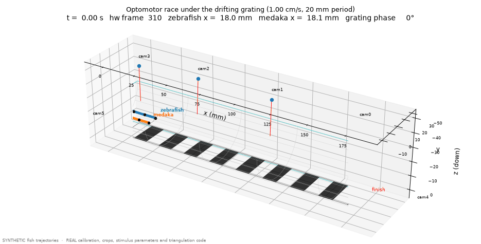
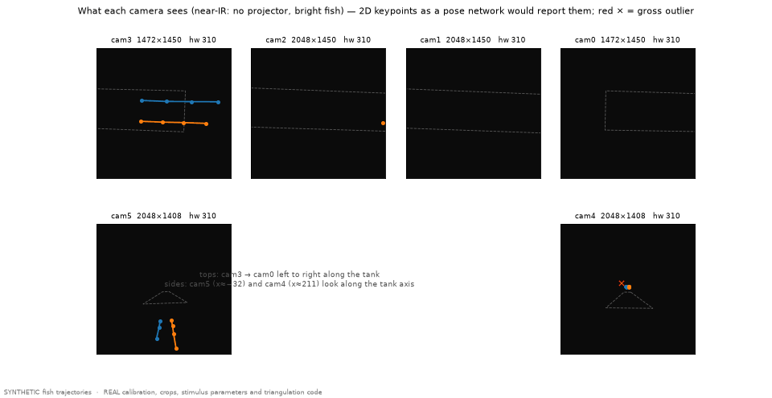
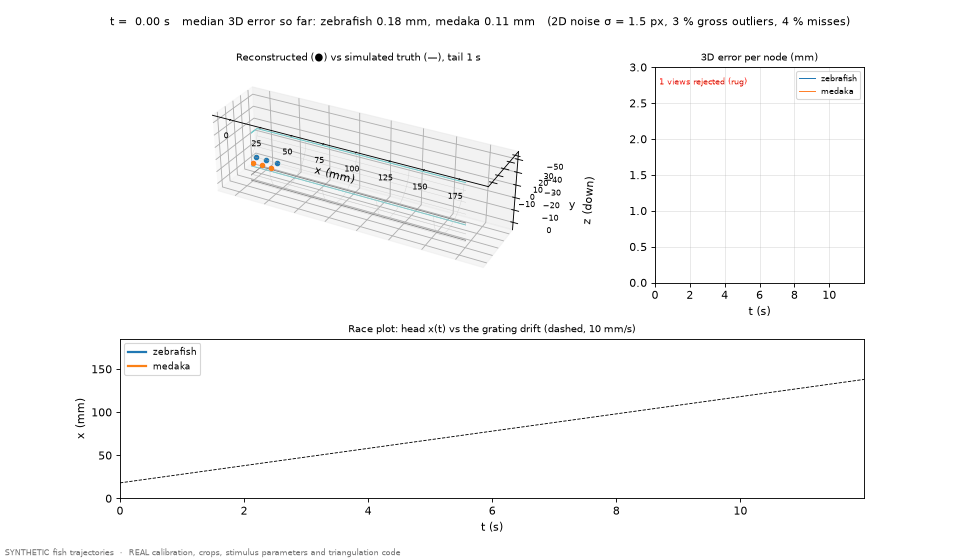
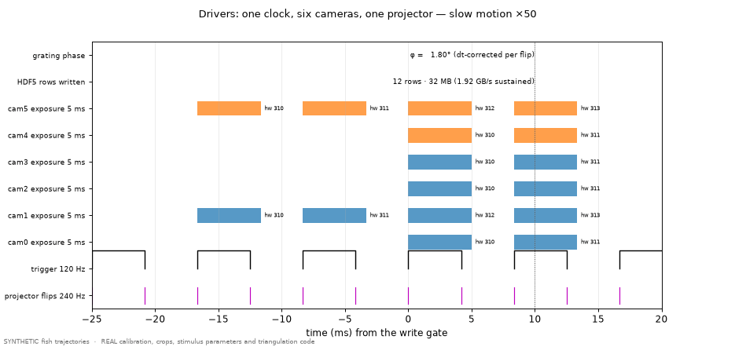
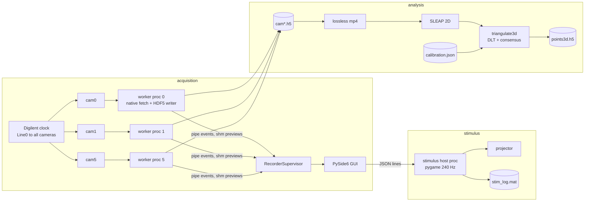

# rig-studio — a six-camera, hardware-synchronized 3D behaviour rig

Acquisition, metric calibration, projector stimulus, and 3D reconstruction for
a fish-behaviour instrument: six near-IR cameras on a half-cylindrical tank,
one hardware clock, a 240 Hz projector, and a millimetre world frame shared by
all of it. Python + a thin C++ bridge; 86 hardware-free tests.



*Two simulated fish race under the real drifting grating, seen from the six real camera positions — every geometric quantity above comes from the shipped calibration; only the fish are synthetic ([what is real vs simulated](docs/09-simulation-and-demos.md)).*

## What it does, in numbers

| | |
|---|---|
| Synchronized acquisition | 6 cameras at **120 Hz** from one trigger clock; certified with zero hardware-frame-id gaps over a 30 s trial (3596–3598 frames/camera) |
| Sustained data rate | **≈1.9 GB/s** raw (16.0 MB per 6-camera frame set) into pre-allocated HDF5 across two NVMe drives, drop-counted per camera |
| Metric calibration | four top cameras agree to **0.52 mm mean** on 78 shared corners of a printed 4 mm ChArUco grid; side cameras to **0.15 mm** vs their neighbours — every camera solved directly against the physical grid, nothing chained |
| Stimulus | exact port of the legacy Psychtoolbox grating, drift **refresh-independent** via measured-flip integration; defined in tank units (**1.00 cm/s, 20.0 mm period** via a measured 7.858 px/mm); operator-drawn shape layers on top |
| 3D reconstruction | DLT triangulation aligned by hardware frame id; outlier cameras rejected by **pairwise consensus** — a documented counter-example shows why "drop the worst residual" silently fails here |
| Software | ~11 k lines of Python in 62 modules + a 17 kB C++ Spinnaker bridge; one worker **process** per camera; deterministic simulator backend; **86 tests** run without hardware |

## Read this in order

| | |
|---|---|
| [1 · Problem and system](docs/01-problem-and-system.md) | the scientific requirement, the physical layout, the world frame, component map |
| [2 · Synchronized acquisition](docs/02-acquisition.md) | trigger math, throughput budget, process architecture, time axis, certification protocol |
| [3 · Metric calibration](docs/03-calibration.md) | static ChArUco method, cross-validation, side-camera PnP, resulting geometry, limitations |
| [4 · Projector stimulus](docs/04-stimulus.md) | the grating equation, dt-corrected drift, px→mm, the DLP/camera beat root cause |
| [5 · 2D → 3D](docs/05-triangulation.md) | DLT derivation, consensus outlier rejection with a worked vote, outputs |
| [6 · Shape layouts](docs/06-shape-layouts.md) | Aegisub as a layout editor, measured placement rule, compositing math |
| [7 · Decision log](docs/07-decision-log.md) | every consequential choice with its reason — including the abandoned stitch architecture |
| [8 · Lessons](docs/08-lessons.md) | hardware and environment facts that cost days |
| [9 · Demonstrations](docs/09-simulation-and-demos.md) | the fish kinematics model, the observation model, and what the animated demos do and do not claim |
| [Operator manual](docs/operator-manual.md) | day-to-day usage |

## Demonstrations (real geometry, simulated fish)

Generated by `python tools/render_demos.py` from the committed calibration and
config — reproducible, and honest about what is synthetic ([§9](docs/09-simulation-and-demos.md)).

| | |
|---|---|
|  | **What the six cameras see.** The two fish projected through the real camera matrices into the real crops, with pose-network-like 2D keypoints (σ = 1.5 px noise, 4 % misses, 3 % gross outliers marked ×). The dashed shape is the calibration board seen by that camera. |
|  | **2D → 3D with the production code.** `triangulate_views` rebuilds every node from those detections: median 3D error 0.14 mm, 95th percentile 0.5 mm, 480 corrupted camera views voted out by consensus; the residual spikes are the genuinely ambiguous 2–3-view cases, reported rather than hidden. Bottom: the race plot against the 10 mm/s grating drift. |
|  | **The drivers, in slow motion.** One 120 Hz clock, six 5 ms exposures, 240 Hz projector flips phase-locked two per frame, hardware frame ids with the real ±2-frame ragged start, and the byte counter running at 1.92 GB/s. |
|  | **A root cause, not a workaround.** Why 178 Hz capture of a 60 Hz DLP breathed at exactly 2 Hz, and why 240 Hz / 120 Hz does not. |

Interactive: open [`media/interactive_race.html`](media/interactive_race.html)
locally (drag to rotate, wheel to zoom, scrub the race) — a dependency-free
canvas viewer over the same calibration and trajectories.

## Architecture in one picture



## Try it without the hardware

```powershell
pip install -e .                             # Python 3.11; PySide6 pinned <6.9 (see docs/08-lessons.md)
python -m rig_studio.app --backend sim       # full GUI on a deterministic simulated rig
pytest                                       # 86 tests: sim backend, offscreen Qt, SDL dummy video
```

The stimulus host runs windowed on any machine (Run tab, "windowed"). The
calibration and triangulation code runs on the shipped calibration JSON and any
SLEAP `.analysis.h5` exports.

## Repository map

```
tools/render_demos.py   regenerates every demo figure and animation from the committed calibration
rig_studio/
  backend/       Spinnaker (native), Harvesters/GenTL, and sim camera backends
  native/        C++ bridge: frames written straight into caller-owned NumPy storage
  recorder/      one worker process per camera; supervisor state machine; shm preview bus
  recording/     MEX-compatible HDF5 writer, lossless frame export
  trigger/       Digilent clock (divider math ported verbatim)
  safety/        snapshot -> allowlist -> write -> readback -> guaranteed restore
  stimulus/      pygame host, grating math, .ass shape layer, named profiles, per-flip log
  orchestrator/  trial timeline (arm -> gate -> baseline -> stimulus -> stop)
  gui/           PySide6 panels (never touch camera buffers)
multiview3d/
  calibrate_static.py   ChArUco pose per top camera + cross-camera metric QC
  click_side_pnp.py     side cameras: ~10 clicked crossings -> PnP (both mirror hypotheses)
  triangulate3d.py      SLEAP 2D -> tank-mm 3D, hw-id alignment, consensus outlier rejection
  bench_rate.py         empirical concurrent frame-rate ceiling
  h5_to_mp4.py          lossless exports for labelling
  calibrations/         live calibration JSON + QC report
configs/               rig.yaml (every tunable), stimulus profiles, shape layouts (.ass)
tests/                 86 tests, no hardware required
docs/                  the write-up above
```

## Questions a reviewer would ask

**Why not stitch the four top views and track on the panorama?** That was the
first architecture and it reached 0.01–0.27 px seams. It was abandoned because a
panorama is a map of the *water surface*; a fish 15 mm below it appears at
different parallax in adjacent cameras, so the surface is not metric for the
thing being measured. [Decision log](docs/07-decision-log.md)

**Why not anipose / bundle adjustment?** A waved-board bundle adjustment was the
predecessor's route and produced sparse, hard-to-audit results. A motionless
board solved per camera against the printed grid gives an acceptance number in
millimetres with no optimiser to trust blindly. Bundle adjustment remains the
right tool once a distortion model is added.

**Nominal intrinsics — really?** Yes, stated openly: the 5-row target cannot
constrain them, so the gate is metric agreement in the overlaps (0.52 mm), and
the ≈10 px reprojection RMS on the wide cameras is recorded as the reason a
distortion model is the next step. [Calibration, §3.2](docs/03-calibration.md)

**Refraction?** The board is calibrated in water, so the floor plane is metric;
height above it carries an unmodelled bias. Listed as a limitation with the
planned fix, not hidden.

**Why Python for a 240 Hz stimulus and a 1.9 GB/s recorder?** Isolation, not
language: the stimulus is its own high-priority process with a 1-D-row fast path;
acquisition is one process per camera with a C++ bridge writing directly into
NumPy ring storage. Measured, not assumed — see the certification protocol in
[Acquisition, §2.5](docs/02-acquisition.md).

**Why is the tracking video lossless?** Because CRF encoding smeared the dark
near-IR footage precisely where keypoints live. `qp 0` was verified bit-exact
against the HDF5.

**Why hardware frame ids instead of frame numbers?** Cameras start ±2 frames
apart. Two frames at 120 Hz is 17 ms — 2.5 mm at a zebrafish dart.

**Why a subtitle editor for stimulus geometry?** The operator already places
shapes fluently in Aegisub; its placement semantics were *measured* against
libass (the documented assumption was 61 px wrong) rather than building a new
editor. [Shape layouts](docs/06-shape-layouts.md)

## Status and limits

Live and in use for single-animal trials. Not yet done: distortion/refraction
models, multi-animal cross-view matching and tracklet stitching, a 3D viewer.
Each is scoped in the docs.

## Attribution

Developed in 2026 for a fish-behaviour rig at Harvard (MCB). The acquisition
and stimulus semantics deliberately reproduce a predecessor MATLAB/MEX pipeline
so that historical trials stay comparable.
