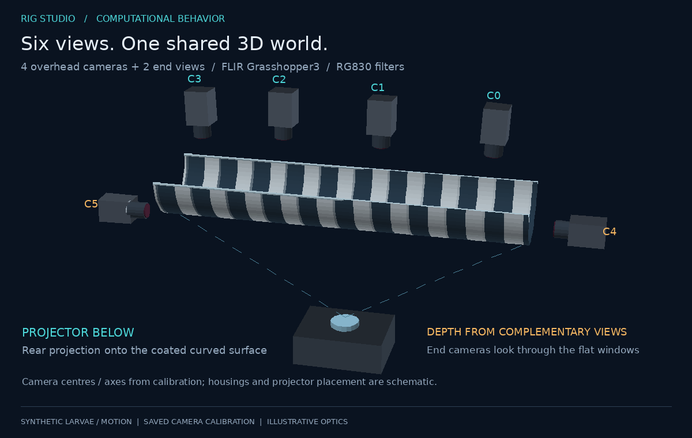
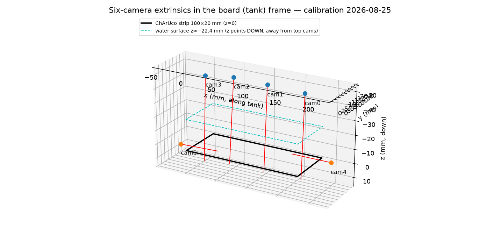
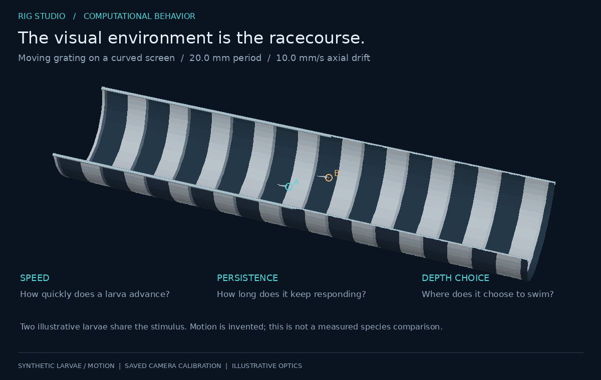

# 1. Problem and system

## The scientific problem

Zebrafish and medaka larvae in a narrow, half-cylindrical trough are shown a
moving pattern projected from below onto its coated curved surface. Species and
age groups can experience the same visual environment so that speed, persistence,
depth choice, and responses to competing cues can be compared. The behavioral readouts are the animal's
3D trajectory, swimming speed, depth, and its timing relative to the stimulus
(optomotor response). The instrument must therefore deliver, per trial:

1. **six synchronized camera streams** at a fixed, known frame rate,
2. **a stimulus whose geometry is expressed in tank millimetres**, not pixels,
3. **a metric 3D coordinate frame** shared by every camera, and
4. **a sub-frame time axis** shared by cameras and stimulus.

Everything in this repository exists to satisfy one of those four lines.

## Physical layout

Four cameras look down along the trough; two end cameras look inward through
the flat end windows. The projector sits below the coated curved surface.
Camera centres in this diagram come from the saved calibration; housings and
projector placement are schematic. See the [real photographs](../README.md#the-real-apparatus).

* Cameras: 6x FLIR Grasshopper3 monochrome, near-IR, behind RG830 long-pass
  filters under IR flood illumination. The filters suppress visible stimulus light in the camera path; the fish
  experiences the projected stimulus. Background rejection depends on the actual optics.
* Sensor crops are frozen: cam0/cam3 1472x1450, cam1/cam2 2048x1450,
  cam4/cam5 2048x1408 pixels.
* Trigger: one hardware clock (Digilent Digital Discovery) into every camera's
  Line0. Frame rate is *only* ever set by this clock.
* Lenses: 6 mm on 5.5 µm pixels (focal length ≈ 1091 px); top cameras sit
  ≈50 mm above the trough floor, hence the wide fields and the visible
  distortion at the edges of the 2048-wide cameras (see §3).

The world frame is fixed by a printed ChArUco strip laid along the trough
floor: **x = 0..180 mm along the tank, y = 0..20 mm across, z perpendicular
to the strip and increasing away from the top cameras** (downward). The water
surface sits at z ≈ −22 mm.

*Illustrative larval bodies and motion; curved stimulus mapping is schematic. See [visual provenance](11-visuals.md).*

## Software components (this repository)

| Component | Role | Key facts |
|---|---|---|
| `rig_studio/backend`, `native/` | Camera access | C++ bridge over the Spinnaker SDK writes frames straight into caller-owned NumPy ring storage; Harvesters/GenTL fallback; deterministic `sim` backend for tests |
| `rig_studio/recorder` | Acquisition | One worker **process** per camera: native handle + fetch thread + HDF5 writer thread; pipe EOF ⇒ clean stop |
| `rig_studio/trigger` | Timing | Digilent clock control, divider math ported from the predecessor C++ |
| `rig_studio/safety` | Camera-state safety | snapshot → allowlist → write → cache-bypassed readback → guaranteed restore; crash markers |
| `rig_studio/stimulus` | Stimulus | pygame host process on the projector; exact port of the Psychtoolbox grating; operator-drawn shape layers; per-flip log |
| `rig_studio/orchestrator` | Trial timeline | arm → trigger → start gate → absolute-POSIX write gate → baseline → stimulus → timed stop |
| `rig_studio/gui` | Operator UI | PySide6 panels; never touches camera buffers |
| `multiview3d/` | Metrology | ChArUco calibration (auto for tops, click-PnP for sides), rate benchmark, lossless export, DLT triangulation with consensus outlier rejection |

Numbers that the rest of the docs build on:

| Quantity | Value | Where measured |
|---|---|---|
| Frame rate (certified) | 120 Hz, 6 cameras concurrently | trial `trial2_20260825_172019`: 3596–3598 frames/camera in 29.97 s, hardware frame ids contiguous, zero gaps |
| Raw data rate | ≈1.9 GB/s (≈16.0 MB per 6-camera frame set) | from the frozen crops above |
| Top-camera metric agreement | 0.52 mm mean over 78 shared corners (gate 1.5 mm) | `media/calibration_report_20260825.txt` |
| Side↔top agreement | 0.155 mm (cam4↔cam0), 0.147 mm (cam5↔cam3) | calibration JSON `qc` |
| Stimulus scale | 7.858 px/mm along the tank | projector footprint measurement, 4 cameras agree within 0.1 % |
| Stimulus defaults | period 157.5 px = 20.0 mm; drift 78.6 px/s = 1.00 cm/s = 0.5 Hz temporal | `configs/rig.yaml` |
| Tests | Hardware-free tests for simulated acquisition, GUI, stimulus, and geometry | `tests/`; not rerun during the documentation refresh |

Research aims are described in the [README](../README.md#the-experiment-beyond-a-finish-time). The current reconstruction is single-animal; multi-animal cross-view identity handling and biological comparisons remain outside the implemented scope.
