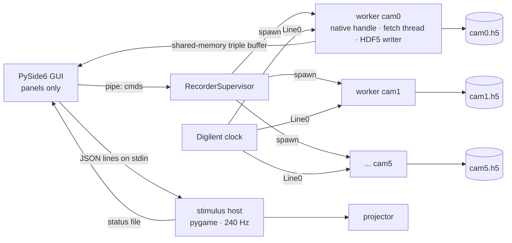
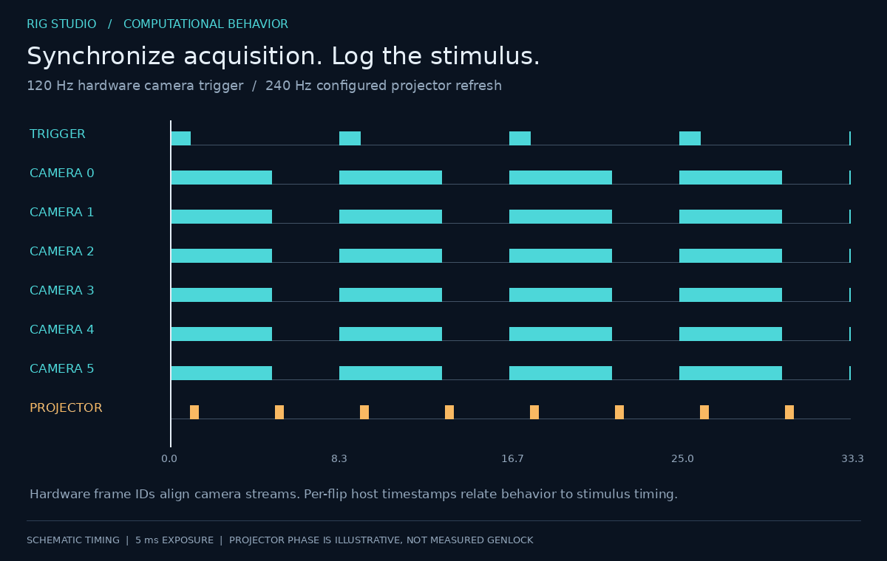

# 2. Synchronized acquisition

## 2.1 One clock, six cameras

Every camera is set to `TriggerSelector=FrameStart, TriggerSource=Line0,
TriggerActivation=RisingEdge` and the `AcquisitionFrameRate` node is **never
written**. The Digilent Digital Discovery produces one square wave per camera
channel (DigitalOut, pulse mode, idle low). The divider math is transcribed from
the predecessor's C++ so that old and new recordings are bit-for-bit comparable
in timing:

```
divider = 1
while round(clk_hz / divider / fps) > counter_max and divider < 1e8:
    divider *= 10
period_ticks = round(clk_hz / divider / fps)          # must be >= 2
high_ticks   = clamp(round(period_ticks * duty), 1, period_ticks - 1)
```

Two hardware facts had to be learned the hard way and are now encoded in
`configs/rig.yaml`:

* **Trigger-line ringing doubles the frame rate.** Without a debouncer the
  falling-edge undershoot of each pulse fires a second exposure whenever the
  sensor is idle. Measured: a 20 Hz clock produced 40 fps. `LineDebouncerTimeRaw
  = 1000` fixes it; the debounce must stay shorter than the pulse high-time
  (1.6 ms at 313 Hz, 50 % duty). The bug was invisible at the old 178 Hz only
  because the sensor had no idle time there.
* **`stop()` must drive every used DIO low** and `start()` must release that
  override again, otherwise the cameras see a floating (or permanently low)
  line and the restart is silently edge-less.

## 2.2 Throughput budget

Per 6-camera frame set, with the frozen crops:

```
2 × (1472 × 1450) + 2 × (2048 × 1450) + 2 × (2048 × 1408) = 15 975 168 B ≈ 16.0 MB
× 120 Hz                                                   ≈ 1.92 GB/s
× 30 s trial                                               ≈ 57 GB
```

This is written uncompressed (the predecessor's baseline; zstd is available but
off) into six pre-allocated HDF5 files, three per NVMe drive. The files are
pre-sized to `ceil(duration × fps) + overhead` rows so that no reallocation
happens mid-trial. Each worker keeps a bounded in-RAM pool (2 s) as a shock
absorber; the writer thread stays streaming rather than accumulating a hidden
multi-gigabyte backlog, and drops — if any — are counted and reported per
camera.

The concurrent ceiling is **row-readout bound**: ≈178 Hz at the earlier
800-row crops, ≈120 Hz at the current 1450-row crops. `multiview3d/bench_rate.py`
measures it empirically by stepping the clock through a staircase of rates
while all six cameras stream and counting delivered frames — a camera that
cannot keep up shows a delivered rate below the commanded one.

## 2.3 Process architecture and crash safety



* **One worker process per camera = one crash domain = one file.** The worker's
  control loop treats pipe EOF as an unconditional clean stop, so a GUI crash
  cannot corrupt an HDF5 file.
* Preview frames reach the GUI through per-camera shared-memory triple buffers;
  the GUI process never holds a camera buffer.
* The stimulus runs in its own process (see §4) so that 240 Hz flip pacing never
  competes with Qt.

Every camera write goes through a guard: snapshot → allowlist check → write →
**cache-bypassed readback** → guaranteed restore at exit. Forbidden nodes
(UserSet, FactoryReset, …) can never be written. Write *order* is load-bearing
on these cameras (VideoMode → PixelFormat → binning → sizes → offsets →
exposure/gain → trigger with `TriggerMode Off` first and `On` last → line →
stream buffers → throughput → chunks); the order is ported verbatim from the
predecessor and unit-tested against the simulated backend.

## 2.4 Time axis and cross-camera alignment

Each HDF5 file carries `/timestamps[N,3] = (t_host_s, writer_seq, hw_frame_id)`.
`t_host` is seconds from one shared **absolute-POSIX write gate** broadcast to
all workers, so all six files share a single origin; `hw_frame_id` is the
camera's own frame counter, delivered as a per-frame chunk.

Cameras start and stop with ±2 frames of raggedness (in `trial2` two cameras
begin at hardware id 308, four at 310). Therefore **alignment across cameras is
by `hw_frame_id`, never by array index**. This is enforced downstream:
`triangulate3d` builds its timeline from the union of hardware ids and maps
each camera's rows onto it.

The stimulus log (§4) records every projector flip with the same host clock,
which is what makes behavior-versus-stimulus phase analysis possible without a
separate sync signal.


*Schematic shared camera trigger and separately clocked projector refresh. The projector phase is illustrative, not measured genlock; per-flip host timestamps provide stimulus timing.*

## 2.5 Certification protocol

A recording configuration is trusted only after:

1. 60 s triggered preview with zero drop badges on all tiles;
2. a short recording, then a full-length soak;
3. per-camera reports show `dropped = 0` and the expected frame count;
4. `hw_frame_id` differences are all exactly 1 for every camera.

`trial2_20260825_172019` (120 Hz, 30 s) passed all four: 3596–3598 frames per
camera, differing only by the start/stop raggedness above.

## 2.6 Exports for tracking

`multiview3d/h5_to_mp4.py` writes one **mathematically lossless** video per
camera (x264 `qp 0`, gray) for SLEAP labelling. Lossy CRF encoding was rejected
after inspection: it smears the dark near-IR footage in exactly the low-contrast
regions where keypoints live. Frame `i` of each mp4 is HDF5 valid-frame `i`, so
the hardware-id mapping survives the export.

The 120 Hz certification above is a historical result recorded in the project notes. The raw trial recordings are not included. Full-resolution crops used for the throughput calculation differ from some earlier Mode2 presets retained in the YAML; see [evidence and configuration scope](10-evidence-and-scope.md).
