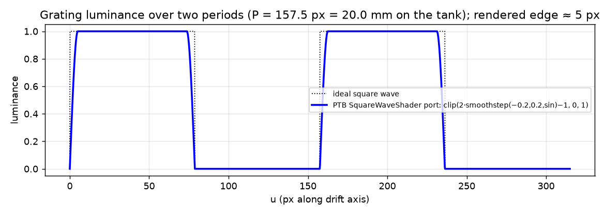
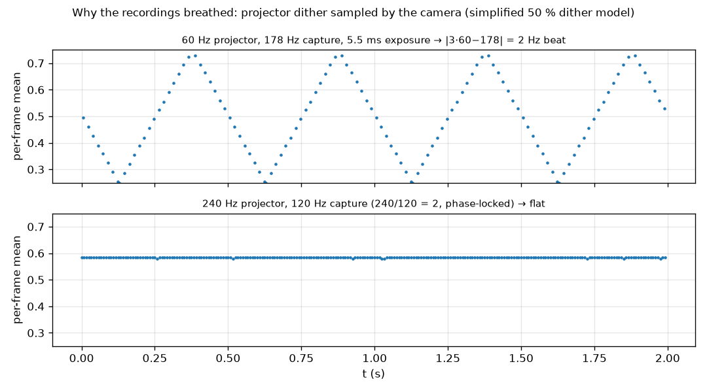

# 4. Projector stimulus

## 4.1 Why a separate process

The stimulus host (`rig_studio/stimulus/host.py`) is a pygame program running
fullscreen on the projector output at 240 Hz. It is a **separate process** fed
JSON lines on stdin and reporting through an atomically-replaced status file,
so a 4.17 ms flip budget never competes with Qt's event loop, and the GUI can
crash or block without the stimulus stuttering. It raises itself to
`HIGH_PRIORITY_CLASS`, measures the true flip interval at start-up, and aborts
on ESC exactly like the Psychtoolbox original.

## 4.2 The grating, exactly as the predecessor drew it

The MATLAB/Psychtoolbox script used a `SquareWaveShader` that is *not* a square
wave. Its luminance along the drift axis u is

$$
L(u) = \mathrm{clip}\big(c \cdot [\,2\,\mathrm{smoothstep}(-0.2,\,0.2,\,\sin(2\pi (u+\varphi)/P)) - 1\,],\ 0,\ 1\big)
$$

with `smoothstep(e0,e1,v) = t²(3−2t), t = clip((v−e0)/(e1−e0), 0, 1)`. The
shader's `duty` parameter was a no-op and is intentionally not implemented.
The port is exact so that new and legacy trials remain comparable.

The rendered edge width follows from where the sine crosses 0 → 0.2:
Δu = P·asin(0.2)/(2π) = 157.5 · 0.2014 / 6.283 ≈ 5.0 px (measured 4.6 px
1 %–99 %). Every other soft edge in the stimulus (§6) defaults to this width so
the whole display has one edge statistic.

## 4.3 Refresh-independent drift

Per flip: φ ← (φ + dir · v · Δt) mod P, where Δt is the **measured**
VBL-to-VBL interval of the previous flip, falling back to the nominal interval
when the measurement is non-finite, ≤ 0 or > 50 ms (a stall). Speed is thus
defined in px/s regardless of whether the projector reports 60 or 240 Hz — a
test arms a short run on SDL's dummy driver and checks the drift recovered from
the log against the commanded speed.

Rendering cost is kept trivial: at 0° rotation one 1-D luminance row is
computed and broadcast over the region; for arbitrary rotation a 4096-entry
luminance LUT is indexed by a precomputed rotated-coordinate grid, so each frame
is a single gather. Colours are a 256-entry RGB ramp between the "dark" and
"bright" colours applied to the luminance.

## 4.4 Pixels → millimetres

The projector footprint of the tank was measured from the four top cameras'
canvas placements (they agree to 0.1 %): **7.858 px/mm along the tank axis**.
Hence the defaults in `configs/rig.yaml`:

| quantity | pixels | on the tank |
|---|---|---|
| spatial period P | 157.5 px | 20.0 mm |
| drift speed v | 78.6 px/s | 1.00 cm/s |
| temporal frequency v/P | | 0.50 Hz |

The legacy 120 px/s therefore corresponded to 1.53 cm/s — which is exactly the
kind of thing a metric stimulus definition exists to make visible.

## 4.5 The projector–camera beat, root-caused

Early recordings "breathed" at ≈2 Hz. The projector is a DLP: each 60 Hz frame
is a dither sequence of micro-mirror states, so a 5.5 ms exposure samples a
*partial* dither cycle. Capturing at 178 Hz against 60 Hz projection gives a
beat at |3·60 − 178| = 2 Hz — matching the observation, and explaining why an
old 20 Hz capture looked fine (60/20 = 3, phase-locked).

Fix: run the projector at 240 Hz and choose capture rates that divide it.
At 120 Hz capture every exposure sees the same projector phase (240/120 = 2),
so there is no beat at all; the first-light exposure of 4166 µs (one projector
frame) additionally averages out one full dither cycle. The cameras do not
image the projector directly (RG830 blocks it), but scattered visible light
still modulated the background enough to matter.

## 4.6 Trial timeline and the stimulus log

`arm → trigger → all cameras streaming → 0.5 s preroll → absolute-POSIX write
gate → 2 s black baseline → grating for N s → timed stop`. Stimulus onset is
`gate + baseline_s` **exactly** (the MATLAB script carried ≈0.2 s of pause
slop). Every flip is logged: `vbl, tStim, dt, missed, yoffset, phaseDeg` plus
the shape-layer scale, saved as a MATLAB-compatible `stim_log_<base>.mat` with
the full parameter set (colours, region, period, speed, shape geometry) as
metadata, so any trial is reproducible from its log alone.

## 4.7 Operator-facing control

All stimulus state lives in **named profiles** (`configs/stimulus_profiles.yaml`),
saved/loaded from the GUI. Colours are pickable per component (bar bright/dark,
screen background, shape rows, window background) and every change is a
parameter, never a code edit. The shape layer on top of the grating is
described in §6.
