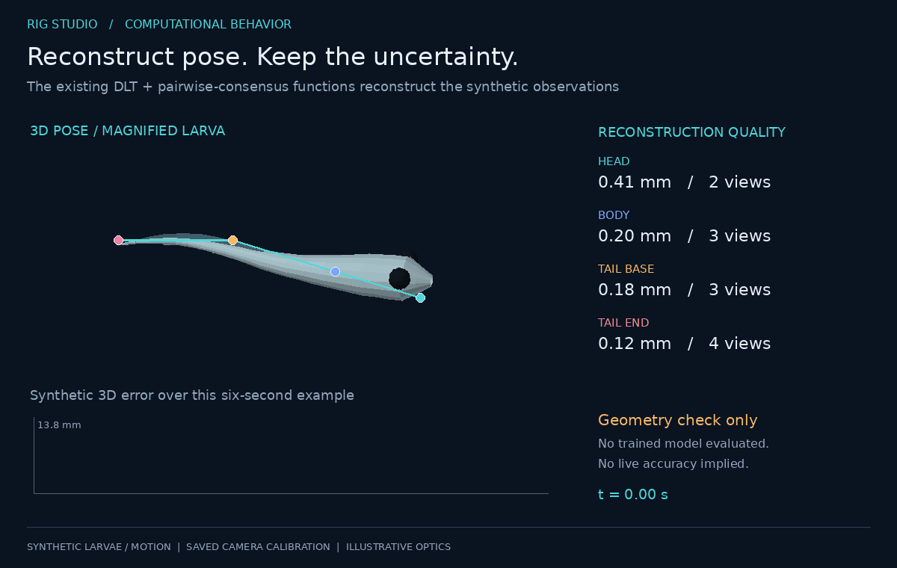

# 5. From 2D tracks to 3D

`multiview3d/triangulate3d.py` turns per-camera SLEAP keypoint tracks into
tank-millimetre 3D trajectories. Single animal for now.

## 5.1 Inputs and alignment

* One SLEAP `.analysis.h5` per camera video (`tracks[n_tracks, 2, n_nodes, F]`,
  `point_scores`), matched to cameras by the `cam<N>` token in the filename.
  How the videos were grouped into SLEAP projects is irrelevant.
* Each camera's recording HDF5, for `/timestamps`. Because the lossless mp4s
  preserve frame order, mp4 frame *i* is HDF5 valid-frame *i*, which carries a
  hardware frame id and a host time.

The common timeline is the **union of hardware frame ids**; each camera's rows
are mapped onto it by id. Aligning by array index would be wrong by up to two
frames (16.7 ms at 120 Hz, corresponding to 5 mm at an illustrative speed of 300 mm/s).

## 5.2 Direct linear transform

For camera *c* with projection matrix `P_c = K_c [R_c | t_c]` (3×4) and a
detection `x_c = (u, v)`, the projective relation `x_c × (P_c X) = 0` yields two
independent linear equations in the homogeneous point `X = (x, y, z, 1)`:

```
( u · P_c[2] − P_c[0] ) · X = 0
( v · P_c[2] − P_c[1] ) · X = 0
```

Stacking the rows of all cameras that saw the keypoint gives `A X = 0`
(2n × 4); the least-squares solution is the right singular vector of the
smallest singular value of `A`, de-homogenised. Reprojection error per view is
`‖π(P_c X) − x_c‖` in pixels and is stored with every point, together with the
number of views used.

A detection participates only if it is finite and its SLEAP confidence is
≥ `--min-score` (default 0.2); a point is produced only with ≥ `--min-views`
(default 2) cameras.

## 5.3 Outlier views: consensus, not "drop the worst"

SLEAP occasionally places a keypoint confidently in the wrong place in one
camera. The obvious remedy — triangulate with all views, drop the view with the
largest residual, repeat — is **wrong for this geometry**, and the repository
keeps the counter-example as a regression test.

Set-up: three cameras (two parallel top views, one side view), a true point at
(90, 10, 12) mm, and one top view corrupted by 40 px. Triangulating with all
three, the DLT compromise assigns the largest residual to the *clean* top
camera (the two parallel views fight over x and the side view barely
constrains it). Dropping it leaves the corrupted view plus the side view, whose
2-view solution is exact by construction (residual ≈ 0) and lands at
(101.5, 10, 11.5) — **11.5 mm off, reported as perfect.**

What is done instead (RANSAC over camera pairs):

1. every pair of views proposes a 3D point;
2. every proposal is scored by the set of views that reproject within
   8 px of it (its inlier set) and the summed inlier error;
3. the largest inlier set wins **only if** it contains more than half the
   views *and* beats every competing set of the same size by > 1 px of summed
   error;
4. otherwise nothing is dropped and the large residual is left in the output.

Worked vote for four views (two tops, two sides), view 2 corrupted by 40 px:

| pair | proposed X (mm) | residuals per view (px) | inlier set |
|---|---|---|---|
| (0,1) | (90, 10, 12) | 0, 0, 40, 0 | {0,1,3} Σ=0 |
| (0,3) | (90, 10, 12) | 0, 0, 40, 0 | {0,1,3} Σ=0 |
| (1,3) | (90, 10, 12) | 0, 0, 40, 0 | {0,1,3} Σ=0 |
| (1,2) | (101.5, 10, 11.5) | 39.5, 0, 0, 5.5 | {1,2,3} Σ=5.5 |
| (2,3) | (101.5, 10, 12.5) | 40.5, 4.8, 0, 0 | {1,2,3} Σ=4.8 |
| (0,2) | (103.2, 10, −30.3) | 0, 205, 0, 242 | {0,2} |

Two sets tie at three inliers; the true one wins on summed error (0 vs 4.8),
and the corrupted view is dropped. With only three views and one bad, every
pair claims two inliers with ≈0 error — a genuine tie — so all three are kept
and the point carries a 40 px residual that downstream filtering can see.
Silent wrong answers are the failure mode this design refuses.


*Existing triangulation functions on noisy synthetic larval observations projected through the saved calibration. No live animal accuracy is implied. See [visual provenance](11-visuals.md).*

## 5.4 Outputs and QC

`triangulated_<calibration tag>/`:

* `points3d.h5` — `points_mm[F, nodes, 3]`, `reproj_px[F, nodes]`,
  `n_views[F, nodes]`, `hw_frame_id[F]`, `t_host[F]`, node names, the
  calibration tag and the frame definition as attributes;
* `points3d.csv` — long format for quick plotting;
* `qc_report.txt` — coverage per node, median / 95th-percentile reprojection
  error, and the x/y/z extent per node (the board footprint is
  0–180 × 0–20 mm, but the trough is wider than the board and has a curved boundary;
  validity checks should use the actual arena volume, not reject all points outside the board footprint).

Verification: synthetic rigs with known ground truth recover points to 1e-6 mm;
an end-to-end test builds fake recordings whose cameras start ±2 frames apart
and checks that the pipeline aligns them by hardware id.

## 5.5 What is deliberately not here yet

* **Multiple animals** — needs cross-view correspondence (epipolar distance +
  Hungarian assignment per frame), a 3D-space tracker with a motion gate that
  tolerates both medaka bouts and zebrafish darts (≈2.5 mm/frame at 120 Hz),
  and identity stitching across occlusions by body length (a robust metric
  fingerprint once the calibration is metric).
* **Refraction-aware rays** — see §3.6; today's z carries an unmodelled bias
  that grows with height above the floor.
* **Smoothing** — none is applied; the raw per-frame estimate is stored so the
  filter is a downstream choice, not baked in.
