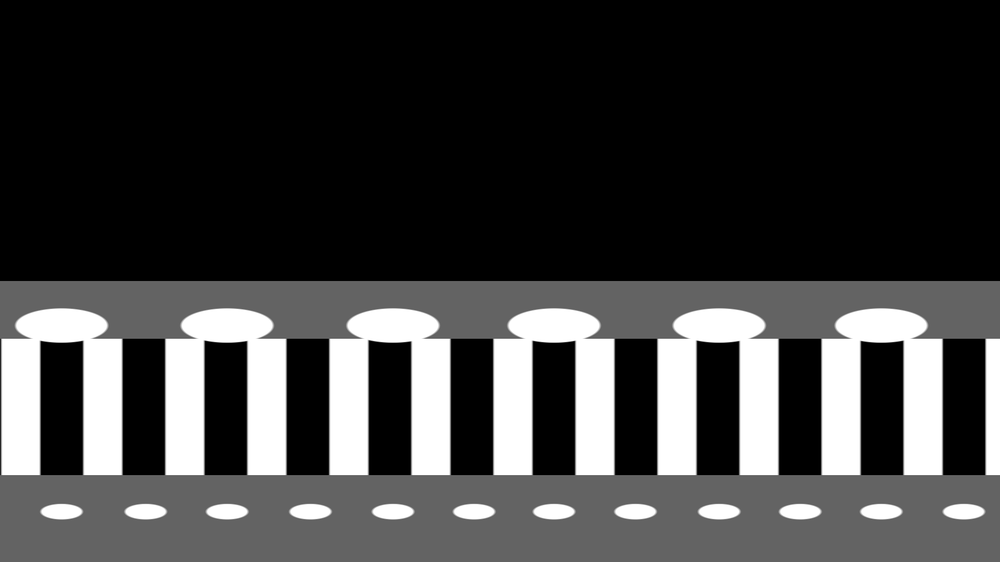
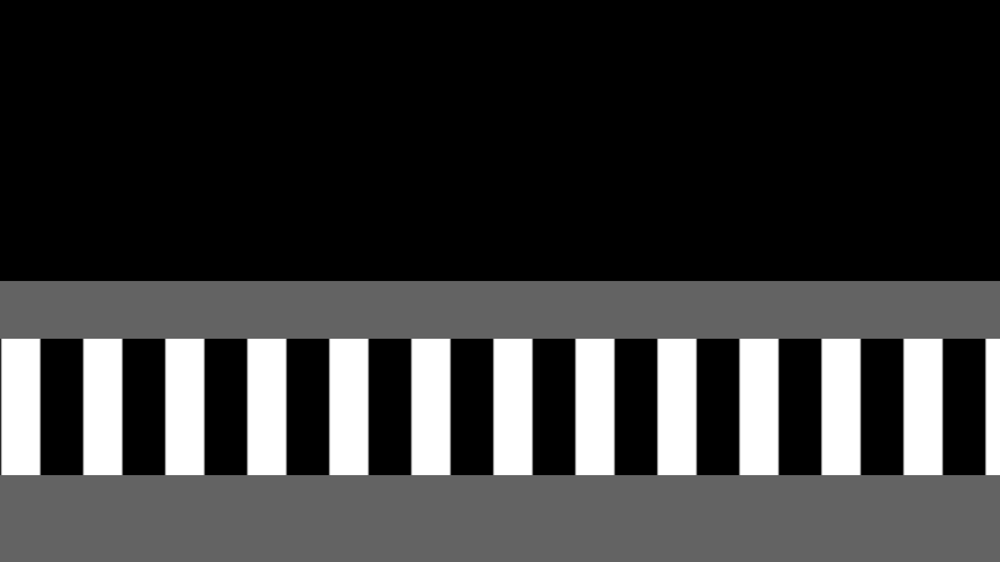

# 6. Operator-drawn stimulus shapes (the `.ass` layer)

Beyond the grating, experiments need static or pulsing shapes on the tank
walls: dots that grow on one wall and shrink on the other, flat covers over the
walls with the grating visible only on the floor, big-vs-small dot rows, and so
on — each needing exact placement on a curved surface.

## 6.1 Reuse the tool the operator already has

Instead of building a geometry editor, the layout format is an Aegisub
subtitle file (`.ass`). Aegisub already provides a vector drawing tool, drag
positioning over a reference frame, independent x/y scaling, a colour picker,
and comment/uncomment to toggle variants. The operator loads
`media/stimulus_current_frame.png` (a rendered grating frame) as the video,
draws, and saves. The software then treats active `Dialogue` lines with `\p1`
drawings as shapes and ignores `Comment` lines. Three layouts ship in
`configs/`:

| file | content |
|---|---|
| `circles.ass` | 12 + 12 ellipses along the two walls, one grating period apart |
| `floor_visible.ass` | two grey rectangles covering the walls |
| `walls_and_dots.ass` | both of the above combined |

The squish the operator applies (`\fscx43\fscy16`, aspect 0.37) is the
perspective correction that makes a projected ellipse look circular from
inside the trough. It is preserved verbatim — the software never reshapes a
shape, only scales it uniformly.

## 6.2 Parsing, and one measured fact

From each drawing line: `\pos(x,y)`, `\fscx`/`\fscy` (percent), `\c&HBBGGRR&`
(ASS stores colours as BGR), and the drawing itself. The drawing's bounding
box is obtained by sampling its cubic Béziers (`b`) and polylines (`l`);
a drawing containing Béziers is rendered as an ellipse, otherwise as a
rectangle.

Where does the shape land? Documentation of `\an` alignment for drawings is
contradictory, so the rule was **measured**: the file was rendered with libass
(via ffmpeg), the rendered shapes were segmented and their centroids compared
with the parsed geometry. Result, for both `\an7` circles and `\an5`
rectangles: **the scaled bounding-box centre lands exactly at `\pos`**
(centroid error < 1 px). The first implementation assumed the bbox *corner* at
`\pos` for `\an7`, which displaced every circle by one radius (61 × 23 px) — a
mistake only a render-and-measure check catches.

## 6.3 Rendering

Each shape becomes a patch over its clipped bounding box with a normalised
radius field:

```
ellipse:   ρ = sqrt(((x−cx)/rx)² + ((y−cy)/ry)²)
rectangle: ρ = max(|x−cx|/rx, |y−cy|/ry)          (Chebyshev)
coverage:  α = clip((s − ρ) · rx / w, 0, 1)      s = current scale, w = edge width (px)
```

so ρ = 1 is the outline at full size and the edge is `w` px wide along x
(default 5 px to match the grating edge). Two compositing styles:

* **fill** — `out = out·(1−α) + colour·α` (opaque shape over the grating);
* **window** — `out = bg·(1−α) + grating·α` (grating visible *only* inside
  the shapes, flat colour elsewhere).

Rules that keep the layer predictable:

* Rectangles are inert backdrops: stamped **first** (z-order), never resized,
  never animated, never recoloured by the per-wall pickers.
* Shapes are assigned to the **top** or **bottom wall** by the **midrange** of
  their y-centres — not the median. The median failed as soon as one wall was
  decimated to every-other circle (6 vs 12 + 2 backdrops): it landed *on* a row
  and tagged all 24 circles as one wall, so two picked colours rendered as one.
  A regression test pins the case.
* Per-wall size factor *f* keeps the rim-side edge pinned so grown circles
  extend toward the floor: `ry' = f·ry`, `cy' = cy ± (f−1)·ry` (+ for the top
  wall, − for the bottom). Per-wall "every Nth" decimation keeps the 1st, (N+1)th, …
  circle from the left.
* Pulsing: scale `s(t) = frac(t/T)` for the growing wall and `1 − s` for the
  shrinking wall, driven by the same dt-corrected clock as the grating; the
  scale is logged per flip.


*Layout `walls_and_dots.ass` with top-wall circles ×1.5 at alternate
positions, bottom-wall circles ×0.7, grating untouched on the floor.*


*Layout `floor_visible.ass`: walls covered, grating on the floor.*

## 6.4 What this bought

Every wall-stimulus variant requested so far has been a *configuration* — a new
`.ass` or a saved profile — rather than code. The GUI exposes one two-column
"top wall / bottom wall" grid (size, every-Nth, colour) with a swap button, a
style selector, pulse controls, and colour pickers; everything is captured in
named profiles and echoed into the trial log.
